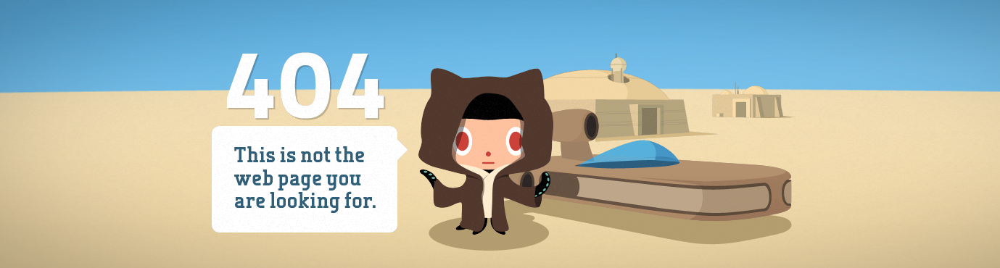

---

<!--START_SECTION:waka-->


**🐱 我的 GitHub 数据** 

> 📦  使用了 97.7 kB GitHub 存储空间 
 > 
> 🏆 546 个贡献，在 2026 年
 > 
> 💼 开放招聘
 > 
> 📜 25 个公共仓库 
 > 
> 🔑 6 个私人仓库 
 > 
**我是早鸟 🐤** 

```text
🌞 早晨                     378 commits         █████░░░░░░░░░░░░░░░░░░░░   19.40 % 
🌆 白天                     664 commits         █████████░░░░░░░░░░░░░░░░   34.09 % 
🌃 傍晚                     658 commits         ████████░░░░░░░░░░░░░░░░░   33.78 % 
🌙 晚上                     248 commits         ███░░░░░░░░░░░░░░░░░░░░░░   12.73 % 
```
📅 **星期四 时的我最有干劲** 

```text
星期一                      247 commits         ███░░░░░░░░░░░░░░░░░░░░░░   12.68 % 
星期二                      355 commits         █████░░░░░░░░░░░░░░░░░░░░   18.22 % 
星期三                      168 commits         ██░░░░░░░░░░░░░░░░░░░░░░░   08.62 % 
星期四                      366 commits         █████░░░░░░░░░░░░░░░░░░░░   18.79 % 
星期五                      286 commits         ████░░░░░░░░░░░░░░░░░░░░░   14.68 % 
星期六                      208 commits         ███░░░░░░░░░░░░░░░░░░░░░░   10.68 % 
星期日                      318 commits         ████░░░░░░░░░░░░░░░░░░░░░   16.32 % 
```


📊 **本周消耗时间** 

```text
🕑︎ 时区: Asia/Shanghai

💬 编程语言: 
Vue                      4 hrs 39 mins       █████████████████████░░░░   82.23 % 
JavaScript               33 mins             ██░░░░░░░░░░░░░░░░░░░░░░░   09.90 % 
JSON                     14 mins             █░░░░░░░░░░░░░░░░░░░░░░░░   04.33 % 
SCSS                     11 mins             █░░░░░░░░░░░░░░░░░░░░░░░░   03.27 % 
Other                    0 secs              ░░░░░░░░░░░░░░░░░░░░░░░░░   00.27 % 

🔥 编辑器: 
VS Code                  5 hrs 39 mins       █████████████████████████   100.00 % 

🐱‍💻 项目: 
MoeKoeMusic              5 hrs 39 mins       █████████████████████████   100.00 % 

💻 操作系统: 
Windows                  5 hrs 39 mins       █████████████████████████   100.00 % 
```

🤖 **AI Coding This Week** 

```text
No AI Coding Activity Tracked This Week
```

**我最常使用 TypeScript** 

```text
TypeScript               28 repos            █████████░░░░░░░░░░░░░░░░   37.84 % 
JavaScript               15 repos            █████░░░░░░░░░░░░░░░░░░░░   20.27 % 
Vue                      14 repos            █████░░░░░░░░░░░░░░░░░░░░   18.92 % 
HTML                     6 repos             ██░░░░░░░░░░░░░░░░░░░░░░░   08.11 % 
NSIS                     1 repo              ░░░░░░░░░░░░░░░░░░░░░░░░░   01.35 % 
```


 Last Updated on 21/08/2026 00:36:36 UTC
<!--END_SECTION:waka-->
