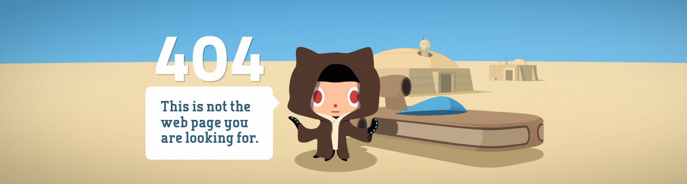

---

<!--START_SECTION:waka-->


**🐱 我的 GitHub 数据** 

> 📦  使用了 99.5 kB GitHub 存储空间 
 > 
> 🏆 590 个贡献，在 2026 年
 > 
> 💼 开放招聘
 > 
> 📜 25 个公共仓库 
 > 
> 🔑 6 个私人仓库 
 > 
**我是早鸟 🐤** 

```text
🌞 早晨                     401 commits         █████░░░░░░░░░░░░░░░░░░░░   19.54 % 
🌆 白天                     680 commits         ████████░░░░░░░░░░░░░░░░░   33.14 % 
🌃 傍晚                     710 commits         █████████░░░░░░░░░░░░░░░░   34.60 % 
🌙 晚上                     261 commits         ███░░░░░░░░░░░░░░░░░░░░░░   12.72 % 
```
📅 **星期四 时的我最有干劲** 

```text
星期一                      253 commits         ███░░░░░░░░░░░░░░░░░░░░░░   12.33 % 
星期二                      378 commits         █████░░░░░░░░░░░░░░░░░░░░   18.42 % 
星期三                      180 commits         ██░░░░░░░░░░░░░░░░░░░░░░░   08.77 % 
星期四                      397 commits         █████░░░░░░░░░░░░░░░░░░░░   19.35 % 
星期五                      297 commits         ████░░░░░░░░░░░░░░░░░░░░░   14.47 % 
星期六                      216 commits         ███░░░░░░░░░░░░░░░░░░░░░░   10.53 % 
星期日                      331 commits         ████░░░░░░░░░░░░░░░░░░░░░   16.13 % 
```


📊 **本周消耗时间** 

```text
🕑︎ 时区: Asia/Shanghai

💬 编程语言: 
Vue                      6 hrs 43 mins       █████████████████░░░░░░░░   66.19 % 
TypeScript               1 hr 51 mins        █████░░░░░░░░░░░░░░░░░░░░   18.32 % 
JSON                     40 mins             ██░░░░░░░░░░░░░░░░░░░░░░░   06.72 % 
JavaScript               23 mins             █░░░░░░░░░░░░░░░░░░░░░░░░   03.87 % 
CSS                      23 mins             █░░░░░░░░░░░░░░░░░░░░░░░░   03.79 % 

🔥 编辑器: 
VS Code                  10 hrs 9 mins       █████████████████████████   100.00 % 

🐱‍💻 项目: 
late-tools               8 hrs 25 mins       █████████████████████░░░░   82.85 % 
moekoe-simple-download   1 hr 26 mins        ████░░░░░░░░░░░░░░░░░░░░░   14.19 % 
Unknown Project          18 mins             █░░░░░░░░░░░░░░░░░░░░░░░░   02.96 % 

💻 操作系统: 
Windows                  10 hrs 9 mins       █████████████████████████   100.00 % 
```

🤖 **AI Coding This Week** 

```text
No AI Coding Activity Tracked This Week
```

**我最常使用 TypeScript** 

```text
TypeScript               29 repos            █████████░░░░░░░░░░░░░░░░   37.66 % 
JavaScript               17 repos            ██████░░░░░░░░░░░░░░░░░░░   22.08 % 
Vue                      14 repos            █████░░░░░░░░░░░░░░░░░░░░   18.18 % 
HTML                     6 repos             ██░░░░░░░░░░░░░░░░░░░░░░░   07.79 % 
NSIS                     1 repo              ░░░░░░░░░░░░░░░░░░░░░░░░░   01.30 % 
```


 Last Updated on 04/10/2026 03:11:23 UTC
<!--END_SECTION:waka-->
